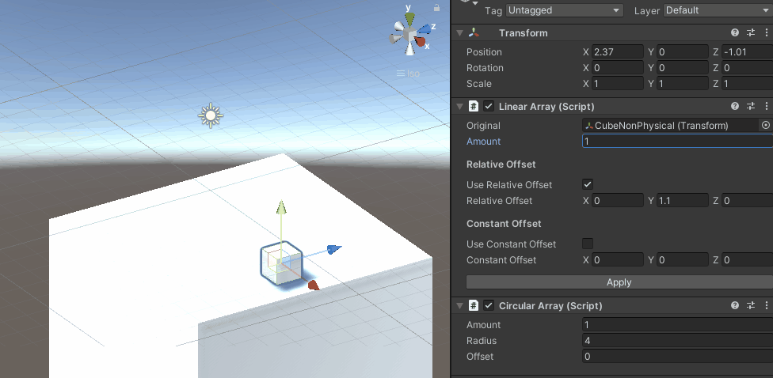
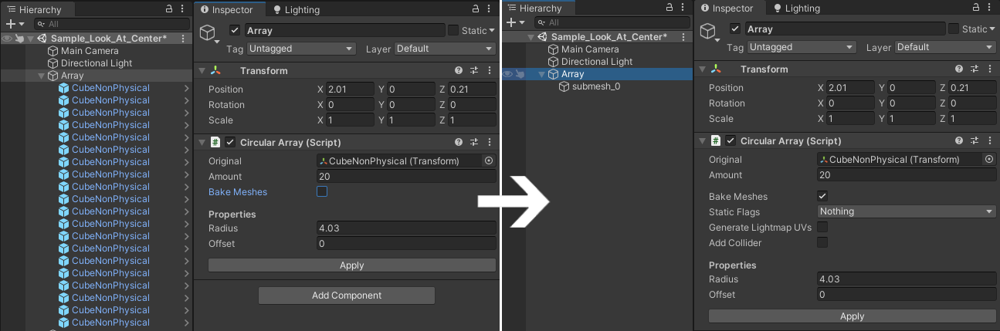
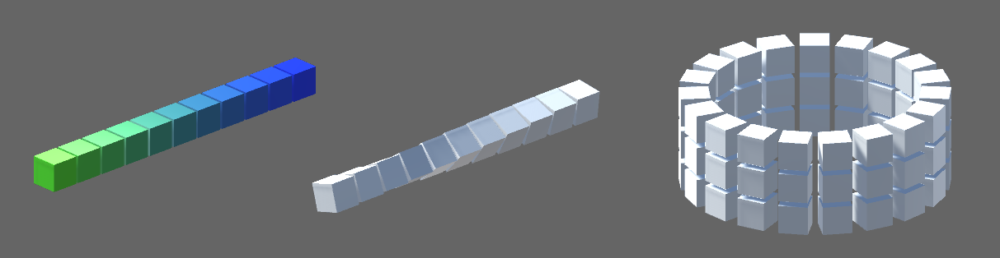

# Unity `GameObject` Arrays

The provided `Array Modifiers` allow for copying a prefab instance in a linear or circular manner to avoid manual placement of such objects.
The amount of copies and the distance between them can be configured and viewed in realtime.



## Installation

The package can be installed via the Unity Package Manager. Simply follow [this guide](https://docs.unity3d.com/Manual/upm-ui-giturl.html) and use the following url: git+https://github.com/Moolt/Unity-GameObject-Array.git?path=Assets/ArrayModifiers

## Usage

The plugin provides the two components `Linear Array` and `Circular Array` which can be added to any `GameObject`. Both components require a prefab, which is the object to be copied by the given `amount`.

**The prefab must contain a Collider**. 2D-Colliders are also supported. If you don't want collision on your objects, you can enable the `Is Trigger` option on the collider.

### Linear Array

`Linear Array` arranges the objects in a straight line. The copies can be offset by either a `Relative Offset` or `Constant Offset`.


### Circular Array

`Circular Array` arranges the objects in a circular manner. The circles radius can be configured.


### Stacking

Array modifiers can be stacked by adding multiple array modifier components.

### Apply

The arrays modifiers can be applied (meaning removed) by using the `Apply`-Button. This will apply and remove **all** modifiers on the object.

Applying differs from manually removing an array modifier component since the latter will also cleanup all copies created by this modifer.

## Usage in realtime

Arrays can also be modified during runtime by using the exposed properties:

```csharp
public class ArrayController : MonoBehaviour
{
    [SerializeField] private LinearArray linearArray;

    private void Start()
    {
        linearArray.Amount = 10;
        linearArray.ConstantOffset = new Vector3(1f, 0f, 1f);
    }
}
```

Even though having many objects in the scene is inefficient the array modifiers are optimized for realtime manipulation, see `Optimization`.

## Mesh baking

Handling too many GameObjects can significantly impact the performance of your game. To reduce the amount of objects in the scene, the meshes of the copies prefabs can be combined into one. If your prefab contains multiple materials, there will be one submesh per material.

You can also set static flags, generate lightmap UVs or add a box collider to the resulting submeshes.



## Object pooling

The array modifiers are optimized by using object pooling.
This means that value changes on the modifier will not cause all objects to be removed and reinstantiated. 
Instead the positions of the already existing objects will be updated. If the user changes the amount of copies, the object pool will be filled or drained accordingly.

Object pooling is not available when mesh baking is enabled.

## Post processors

Postprocessor-Components can be used to modify the copied instances, for example to change their color, rotation or scale. Postprocessors are called after copying and before mesh baking (if enabled).

Currently `ColorPostProcessor`, `RotationPostProcessor` and `LookAtCenterPostProcessor` are provided by the plugin.



To write your own postprocessor, you can extent the `PostProcessor` class:

```csharp
public class MyPostProcessor : PostProcessor
{
    public override void Execute(InstanceInfo info)
    {
        var (instance, root, totalCount, index) = info;

        // do stuff with instance
        instance.localScale = Vector3.one * index;
    }
}
```

The `Execute`-Method will be called for each instance and takes an `InstanceInfo` as parameter. The `InstanceInfo` contains the copied instance, the root / parent object, the total amount of copies and the index of the instance.

## Creating custom arrays

To create custom array modifiers you can inherit from the `ArrayModifier` class.
The only method that needs to be implemented is `RelativePositionFor` which returns a position for a copy at `index` in `local space`.
Additionally the colliders `bounds` of the prefab are passed which can be used in calculations. See the code of `Linear Array` and `Circular Array` for better examples. They are really quite simple.

```csharp
public class MyArrayModifier : ArrayModifier
{
    protected override Vector3 RelativePositionFor(int index, Bounds bounds)
    {
        return return Vector3.up * index;
    }
}
```

## Known issues

* Unity may throw some errors when undoing deletion of an array modifier. This is just Unity doing Unity stuff, nothing serious.
* When Debug is enabled in the inspector changing values will not update the array.