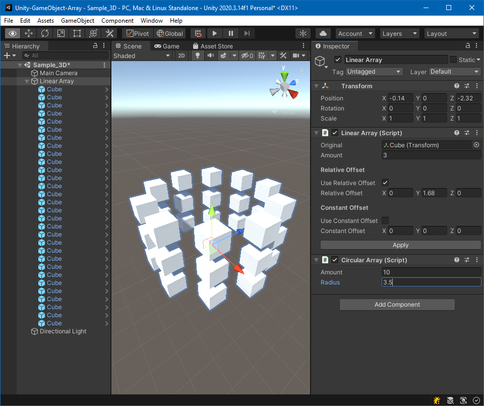
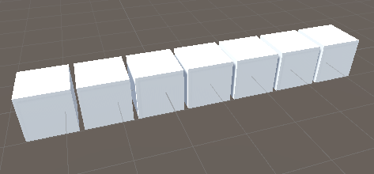
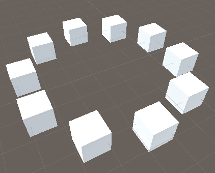

# Unity `GameObject` Arrays

The provided `Array Modifiers` allow for copying a prefab instance in a linear or circular manner to avoid manual placement of such objects.
The amount of copies and the distance between them can be configured and viewed in realtime.



## Installation

You can download the Unity package [here](https://github.com/Moolt/Unity-GameObject-Array/raw/main/array_modifiers.unitypackage).
Open it with Unity and import the `ArrayModifiers` directory for the array modifier scripts or everything, if you want the example scenes included.

## Usage

The plugin provides the two components `Linear Array` and `Circular Array` which can be added to any `GameObject`. Both components require a prefab, which is the object to be copied by the given `amount`.

**The prefab must contain a Collider**. 2D-Colliders are also supported. If you don't want collision on your objects, you can enable the `Is Trigger` option on the collider.

### Linear Array

`Linear Array` arranges the objects in a straight line. The copies can be offset by either a `Relative Offset` or `Constant Offset`.



### Circular Array

`Circular Array` arranges the objects in a circular manner. The circles radius can be configured.



### Stacking

Array modifiers can be stacked by adding multiple array modifier components.

### Apply

The arrays modifiers can be applied (meaning removed) by using the `Apply`-Button. This will apply and remove **all** modifiers on the object.

Applying differs from manually removing an array modifier component since the latter will also cleanup all copies created by this modifer.

## Usage in realtime

Arrays can also be modified during runtime by using the exposed properties:

```csharp
public class ArrayController : MonoBehaviour
{
    [SerializeField] private LinearArray linearArray;

    private void Start()
    {
        linearArray.Amount = 10;
        linearArray.ConstantOffset = new Vector3(1f, 0f, 1f);
    }
}
```

Even though having many objects in the scene is inefficient the array modifiers are optimized for realtime manipulation, see `Optimization`.

## Optimization

The array modifiers are optimized by using object pooling.
This means that value changes on the modifier will not cause all objects to be removed and reinstantiated. 
Instead the positions of the already existing objects will be updated. If the user changes the amount of copies, the object pool will be filled or drained accordingly.

## Known issues

* Unity may throw some errors when undoing deletion of an array modifier. This is just Unity doing Unity stuff, nothing serious.
* Removing an array modifier may not update the copies correctly. Change any value on the component to force an update.